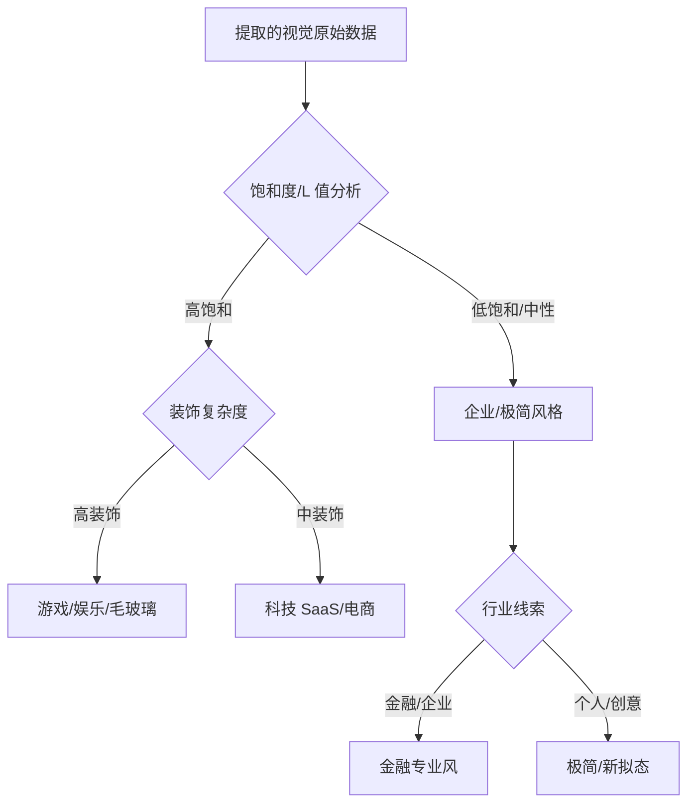

# 设计风格库参考 (Style Library)

> 用于在「设计推理与匹配」步骤中，将感知层提取的原始数据与预设风格进行匹配。

---

## 1. 极简主义 (Minimalist)

| 属性 | 特征 |
|------|------|
| **配色** | 大量留白、中性色为主（灰/白/米色），1-2个强调色 |
| **排版** | 无衬线字体、大字号层级差、宽松字间距 |
| **布局** | 大量留白、网格规整、对称或黄金分割 |
| **装饰** | 极少的装饰元素、细边框、无渐变或少渐变 |
| **图标** | 线性图标、简洁符号 |
| **阴影** | 轻微或无明显阴影 |
| **行业适配** | 奢侈品、设计工作室、个人品牌、SaaS 工具 |

### Token 参考
```css
--color-bg: #FAFAFA;
--color-primary: #1A1A1A;
--color-accent: #C91A1A;
--font-family-sans: 'Inter', -apple-system, sans-serif;
--spacing-section: 6rem;
```

---

## 2. 毛玻璃效果 (Glassmorphism)

| 属性 | 特征 |
|------|------|
| **配色** | 鲜艳背景 + 半透明白色/彩色玻璃层、高饱和渐变色 |
| **排版** | 现代无衬线、文字放在玻璃层上 |
| **布局** | 层叠式布局、不规则形状、层次感强 |
| **装饰** | 毛玻璃卡片（backdrop-filter: blur）、半透明边框 |
| **阴影** | 有层次感的投影 |
| **行业适配** | 创意工作室、游戏、音乐/娱乐、科技产品 |

### Token 参考
```css
--glass-bg: rgba(255, 255, 255, 0.15);
--glass-border: rgba(255, 255, 255, 0.3);
--glass-shadow: 0 8px 32px rgba(0, 0, 0, 0.1);
--glass-blur: blur(12px);
--color-primary: #7928CA;
--color-secondary: #FF0080;
```

---

## 3. 新拟态 (Neumorphism)

| 属性 | 特征 |
|------|------|
| **配色** | 单一底色（同色系）、极近似色的阴影 |
| **排版** | 柔和、友好的无衬线字体 |
| **布局** | 卡片式、内嵌/外凸交替的立体感 |
| **装饰** | 内阴影和外阴影组合、无边框设计 |
| **行业适配** | 个人工具、音乐播放器、仪表盘 |

### Token 参考
```css
--bg-neumorph: #E0E5EC;
--shadow-light: 8px 8px 16px #A3B1C6, -8px -8px 16px #FFFFFF;
--shadow-inset: inset 4px 4px 8px #A3B1C6, inset -4px -4px 8px #FFFFFF;
--color-primary: #2D3436;
--radius-card: 16px;
```

---

## 4. 扁平设计 (Flat Design)

| 属性 | 特征 |
|------|------|
| **配色** | 明亮、高饱和、多色搭配、对比强烈 |
| **排版** | 简洁无衬线、大字重对比 |
| **布局** | 网格清晰、区块分明 |
| **装饰** | 无阴影、无渐变、直角或小圆角 |
| **图标** | 纯色填充图标 |
| **行业适配** | 面向大众的 App、政府网站、教育平台 |

### Token 参考
```css
--color-primary: #3498DB;
--color-secondary: #2ECC71;
--color-accent: #E74C3C;
--color-warning: #F39C12;
--font-family-sans: 'Segoe UI', system-ui, sans-serif;
--radius-sm: 2px;
--radius-md: 4px;
--shadow-none: none;
```

---

## 5. Material Design (Google)

| 属性 | 特征 |
|------|------|
| **配色** | 以 primary/accent 为核心的多层色板、遵循 Material Color System |
| **排版** | Roboto/Noto 字体、严格层级体系 |
| **布局** | 8dp 栅格系统、响应式 12 列网格、卡片分层 |
| **装饰** | 阴影基于 z-depth（dp 值）、涟漪动效 |
| **图标** | Material Icons |
| **行业适配** | 安卓应用、跨平台工具、Google 生态产品 |

### Token 参考
```css
--md-primary: #1976D2;
--md-primary-dark: #1565C0;
--md-primary-light: #BBDEFB;
--md-surface: #FFFFFF;
--md-elevation-1: 0 1px 3px rgba(0,0,0,0.12), 0 1px 2px rgba(0,0,0,0.24);
--md-elevation-4: 0 4px 6px rgba(0,0,0,0.15);
--font-family: 'Roboto', sans-serif;
```

---

## 6. 金融/企业专业风 (Corporate / Enterprise)

| 属性 | 特征 |
|------|------|
| **配色** | 深蓝/藏青为主、灰白为辅、低饱和强调色 |
| **排版** | 传统稳重字体、清晰层级、保守间距 |
| **布局** | 功能优先、信息密度适中、侧边栏导航 |
| **装饰** | 简洁正式、弱化装饰、突出数据和功能 |
| **行业适配** | 银行、保险、企业管理、政府系统、B2B SaaS |

### Token 参考
```css
--color-primary: #1E3A5F;
--color-primary-light: #2B5A8C;
--color-primary-dark: #0F2440;
--color-accent: #D4A843;
--color-bg: #F5F7FA;
--color-text: #2C3E50;
--color-success: #27AE60;
--color-error: #C0392B;
--font-family-sans: 'Noto Sans SC', 'Source Han Sans CN', 'Microsoft YaHei', sans-serif;
--spacing-section: 3rem;
```

---

## 7. 电商/零售 (E-commerce / Retail)

| 属性 | 特征 |
|------|------|
| **配色** | 温暖活泼（橙/红/粉/黄）、高饱和、促销色突出 |
| **排版** | 大号、醒目标题、CTA 按钮文字粗体 |
| **布局** | 商品网格密集、多层瀑布流、Banner 突出 |
| **装饰** | 渐变点缀、标签/徽章、折扣标志醒目 |
| **行业适配** | 电商平台、零售品牌、促销活动 |

### Token 参考
```css
--color-primary: #FF6B35;
--color-secondary: #004E89;
--color-accent: #FFD166;
--color-price: #E63946;
--color-discount: #FF3333;
--font-family-sans: system-ui, -apple-system, sans-serif;
--spacing-section: 2rem;
--radius-badge: 0 8px 0 8px;
```

---

## 8. 科技/SaaS 现代风 (Tech / SaaS Modern)

| 属性 | 特征 |
|------|------|
| **配色** | 渐变主色（紫→蓝、蓝→青）、深色模式支持、干净白底色 |
| **排版** | 现代几何无衬线字体、宽松行距、大字重 |
| **布局** | 大幅留白、大 Hero 区域、功能分区明确 |
| **装饰** | 柔和渐变、微动效、大图标/插画 |
| **行业适配** | 科技创业、SaaS 平台、开发者工具、AI 产品 |

### Token 参考
```css
--color-primary: #6C63FF;
--color-primary-gradient: linear-gradient(135deg, #667EEA 0%, #764BA2 100%);
--color-bg: #FFFFFF;
--color-bg-alt: #F8F9FE;
--color-text: #1A202C;
--color-text-secondary: #718096;
--font-family-sans: 'Inter', 'SF Pro Display', system-ui, sans-serif;
--spacing-section: 5rem;
--radius-md: 8px;
```

---

## 9. 内容/媒体 (Content / Media)

| 属性 | 特征 |
|------|------|
| **配色** | 白色背景 + 深色正文、强调色用于链接和标注 |
| **排版** | 衬线字体用于正文、良好可读性、宽松行高（1.6-1.8） |
| **布局** | 文章式布局、侧边栏、首字母下沉 |
| **装饰** | 极简、突出内容而非 UI |
| **行业适配** | 新闻、博客、出版社、文档站点 |

### Token 参考
```css
--color-bg: #FFFFFF;
--color-text: #1A1A1A;
--color-link: #2563EB;
--font-family-serif: 'Georgia', 'Noto Serif SC', serif;
--font-family-sans: system-ui, -apple-system, sans-serif;
--font-size-body: 1.125rem;
--line-height-body: 1.75;
--max-width-article: 720px;
--spacing-paragraph: 1.5rem;
```

---

## 10. 游戏/娱乐 (Gaming / Entertainment)

| 属性 | 特征 |
|------|------|
| **配色** | 鲜明、高饱和、霓虹色、深色背景、渐变色 |
| **排版** | 粗体、动态字体、斜体或特殊字形 |
| **布局** | 动态非对称布局、全屏沉浸式体验 |
| **装饰** | 发光效果（text-shadow/box-shadow）、动态背景、粒子 |
| **行业适配** | 游戏平台、电竞、流媒体、娱乐 App |

### Token 参考
```css
--color-bg: #0A0A1A;
--color-primary: #FF3366;
--color-secondary: #00F5FF;
--color-accent: #FFD700;
--color-glow: 0 0 20px rgba(255, 51, 102, 0.6);
--font-family: 'Poppins', system-ui, sans-serif;
--spacing-section: 4rem;
```

---

## 风格匹配决策指南



> 本风格库作为匹配参考，实际风格识别应严格基于输入素材的视觉特征，而非预设偏好。
